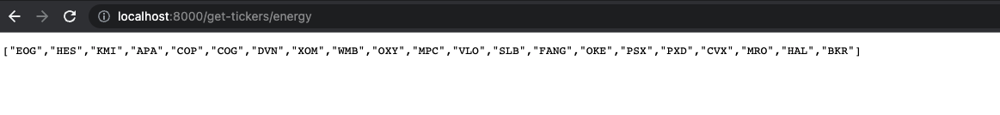

# Python FastAPI App 

version: 1.2.0.0
<h3>Overview</h3>
<h4>
This is a small python application that uses the <a href="https://fastapi.tiangolo.com/">Fastapi Framework</a>. This app creates api endpoints  
that users can use to fetch stock tickers from the SP500, you can filter tickers by sector.
</h4>

 

## Install Python Modules setup

<code>pip3 install -r requirements.txt</code> 

 

## Run App locally

<code>uvicorn:api:app --reload</code> 
 <strong>Base URL: </strong>  <u>localhost:8000/</u> 
  <i>By default, local server will run on port:8000, if this port is not open, server will run on a different port 
check code output for specified port.
</i>

 
 
 API Endpoints 
----------------------
<table style="background-color: #38A3A5", "color: #fff">
  <tr>
    <th>Endpoint</th>
    <th>Data</th>
  </tr>
  <tr>
    <td>{baseurl}/</td>
    <td>Index Page</td>
  </tr>
    <tr>
    <td>{baseurl}/docs</td>
    <td>Fastapi Docs</td>
  </tr>
  <tr>
    <td>{baseurl}/get-tickers/sp500</td>
    <td>All SP 500 Tickers</td>  
  </tr>
  <tr>
    <td>{baseurl}/sectors</td>
    <td>All sector names in SP500</td> 
  </tr>
   <tr>
    <td>{baseurl}/get-tickers{sector_id}</td>
    <td>ALL stock tickers in target sector</td>
  </tr>
  
</table>

 
<table style="background-color: #38A3A5", "color: #fff">
    <th>Sector Id(s)</th>
            <tr>
                <td>
                financials
                </td>
            </tr>
            <tr>
                <td>
                consumer-cyclical
                </td>
            </tr>
            <tr>
                <td>
                real-estate
                </td>
            </tr>
            <tr>
                <td>
                utilities
                </td>
            </tr>
            <tr>
                <td>
                basic-materials
                </td>
            </tr>
            <tr>
                <td>
                communication-services
                </td>
            </tr>
            <tr>
                <td>
                healthcare
                </td>
            </tr>
             <tr>
                <td>
                technology
                </td>
            </tr>
             <tr>
                <td>
                consumer-defensive
                </td>
            </tr>
             <tr>
                <td>
                financial-services
                </td>
            </tr>
             <tr>
                <td>
                industrials
                </td>
            </tr>
</table>
 

Example: Usage
--------------
 

objective: After running app locally, Get all stock tickers from Engergy sector in Sp500 index.

<code>localhost:8000/get-tickers/energy</code>
 

 <i>Output Figure</i>

Deploy to Heroku
--------------
1. Create a requirements file that lists all required modules  inside project folder run this command: `pip3 freeze > requirements.txt`
2. Remember to specify which python version you are using by creating a runtime.txt file `touch runtime.txt`
Heroku will need this file.  <i>file is both case and space sensitive, use this format: `python-3.9.7`</i>
3. Create a Procfile   `touch Procfile`   type the following:  `web: uvicorn api:app --host=0.0.0.0 --port=${PORT:-5000}`

 

<button style="font-size: 30px; margin-top:50px; border-radius:5px;">

  <a style="text-decoration: none; color: steelblue; font-size: 30px;" href="https://stock-tickers-api.herokuapp.com/">Live Demo</a>

</button>

